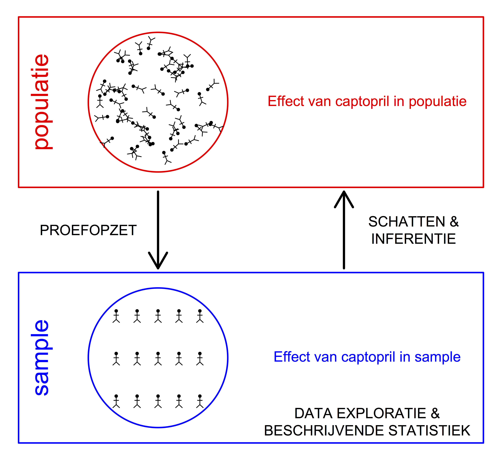
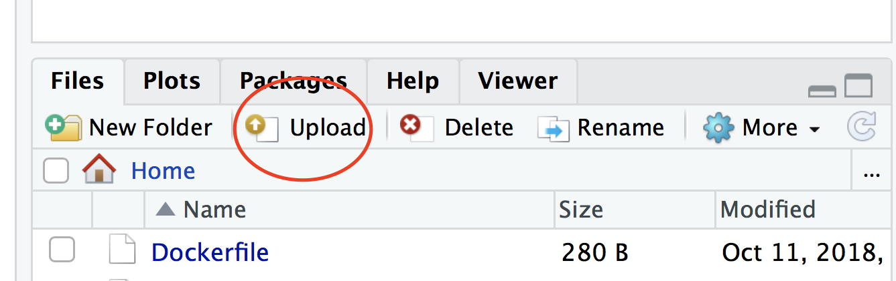

### Achtergrond

Deze cursus is een basiscursus statistiek voor studenten in de levenswetenschappen en wordt aan de Universiteit Gent gedoceerd in de Bachelor of Science in de Biologie, Bachelor of Science in de Biochemie en Biotechnologie, Bachelor of Science in de Chemie en Bachelor of Science in de Biomedische Wetenschappen.

De cursus is opgevat als een e-course en alle materiaal wordt via deze github website  beschikbaar gesteld.
Hier vind je links naar de cursusnota, slides en materiaal voor de oefeningen.
De website zal gedurende het eerste semester van academiejaar 2018-2019 verder worden uitgebouwd.

De communicatie en indienen van projectwerk verloopt via het digitale leerplatform van de universiteit: [minerva](https://minerva.ugent.be).

Het examen is een open boek examen, waarbij u niet alleen gebruik mag maken van uw eigen cursus, maar ook van opgeloste oefeningen en examens, boeken, andere cursussen, ...

De projecten zijn een verplicht onderdeel van het examen en moeten, zonder uitzondering, door iedereen worden gemaakt.

Er wordt verwacht dat u de cursus grondig studeert ter voorbereiding van het examen. De slides kunnen als samenvatting dienen, maar volstaan op zich niet. Dit is deels omdat sommige onderdelen onder de vorm van zelfstudie aan bod komen, en omdat het examen een belangrijke focus heeft op het correct formuleren van conclusies op basis van een statistische analyse. Sommige onderdelen van de cursus worden enkel via de PC practica aangebracht. We raden daarom aan om deze practica bij te wonen. U zult hier ook getraind worden in het kiezen van een juiste analyse voor de gegevens, in het lezen van computer output, ... Op deze vaardigheden (niet op het uitvoeren van analyses op de computer) wordt u ook op het examen getest. Velen zullen ook in latere cursussen en tijdens het maken van de bachelor en masterproef met de statistische software R in contact komen voor het verwerken van data. De PC practica zijn deels bedoeld als voorbereiding hierop.

---

### Online cursus

- [e-cursus Statistiek](https://statomics.github.io/statistiekCursusNotas/)
- [Cursus in pdf formaat](https://statomics.github.io/statistiekCursusNotas/Statistiek_2018_2019.pdf)
- [Data](https://statomics.github.io/statistiekCursusNotas/data.zip)

### Assistenten

- Bachelor of Science in de Biologie en Bachelor of Science in de Chemie: Jeroen Gillis (Jeroen dot Gilis at UGent dot be)
- Bachelor of Science in de Biochemie en Biotechnologie: Koen Van den Berge (Koen dot VanDenBerge @ UGent dot  be)
- Bachelor of Science in de Biomedische Wetenschappen: Elke Debrie (Elke dot Debrie at UGent dot be)

### Praktisch
- [Praktisch](assets/00-Afspraken.pdf)

---

### Software

Tijdens de practica zullen we gebruik maken van het statistisch softwarepakket R, en de grafische user interface RStudio.
Het is aangeraden dat om een eigen laptop te gebruiken voor de practica waarop je reeds R en RStudio geïnstalleerd hebben.

[Installatie van statistisch software pakket R](pages/software/RStudio_installeren.html)

Je kan ook gebruik maken van RStudio op het [Athena](https://athena.ugent.be) van Universiteit Gent. Dan is het wel belangrijk dat je voldoende plaats hebt op je netwerk drive (H-schijf) van de universiteit en dat je work directory en data zich ook op deze drive bevinden. Het gebruik van work directories en data vanop je eigen laptop of computer zorgt voor onnodige belasting van het netwerk, leidt tot traag runnen van RStudio en instabiliteit.

Om snel een aantal zaken te testen zonder R te installeren, kan er ook gebruik gemaakt worden van RStudio in je webbrowser via de binder link die gekoppeld is aan de cursus site. Let op dat deze R sessies wel snel verlopen bij inactiviteit.

Je kan files en RMarkdown scripts uploaden naar RStudio in de webbrowser via de "Upload tab" in het venster rechts onder in Rstudio.

Tijdens de practica zullen we steeds gebruik maken van RMarkdown notebooks die toelaten om tekst, computercode en statistische output te combineren in een bestand. Het laat toe om de resultaten eenvoudig te rapporteren in een webpagina of een pdf bestand. 
Voor de ontwikkeling van eigen Rmarkdown notebooks kan je steeds beroep doen op de online cursus nota's die heel veel code bevat en een handige RMarkdown-cheatsheet: 

[Rmarkdown cheatsheet](practica/rmarkdown-cheatsheet.pdf)

Het is aangeraden om reeds vertrouwd te zijn met R en RStudio alvorens jullie het eerste practicum meevolgen.
Er wordt verondersteld dat jullie volgende introductie zelfstandig doornemen:

[Intro](practica/zelfstudie.md)

---

### Topics

  1. Inleiding
  - Slides:  [Inleiding](assets/01-Inleiding.pdf)

  2. Belangrijke concepten & conventies
  - Slides: [Concepten](assets/02-Concepten.pdf)

  3. Studiedesign
  - Zelfstudie
  - Tijdens de les wordt er wel in elk hoofdstuk dieper ingegaan op het design van de centrale datasets die worden gebruikt.

  4. Data exploratie en beschrijvende statistiek
  - Slides: [Data exploratie](assets/04-DataExploratie.pdf)
  - Tutorial: [Data exploratie](practica/practicum1/PC-practicum1.html), [RMarkdown file](practica/practicum1/PC-practicum1.Rmd)

  5. Statistische besluitvorming
  - Slides: [Statistische Besluitvorming](assets/05-StatisticalInference.pdf)

  6. Enkelvoudige lineaire regressie
  - Slides: [Enkelvoudige Lineaire Regressie](assets/06-LineaireRegressie.pdf )

  7. Variantie analyse
  - Slides: [Variantie analyse](assets/07-Anova.pdf)

  8. Niet-parametrische Statistiek
  - Slides: [Niet-parametrische Statistiek](assets/08-NietParametrischeStatistiek.pdf)

  9. Categorische data analyse
  - Slides: [Categorische data analyse](assets/09-CategorischeDataAnalyse.pdf)

  10. Algemeen lineair model

---

##### [Docent: Lieven Clement](https://statomics.github.io/pages/about.html)
